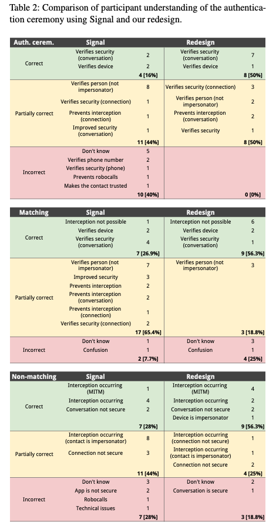
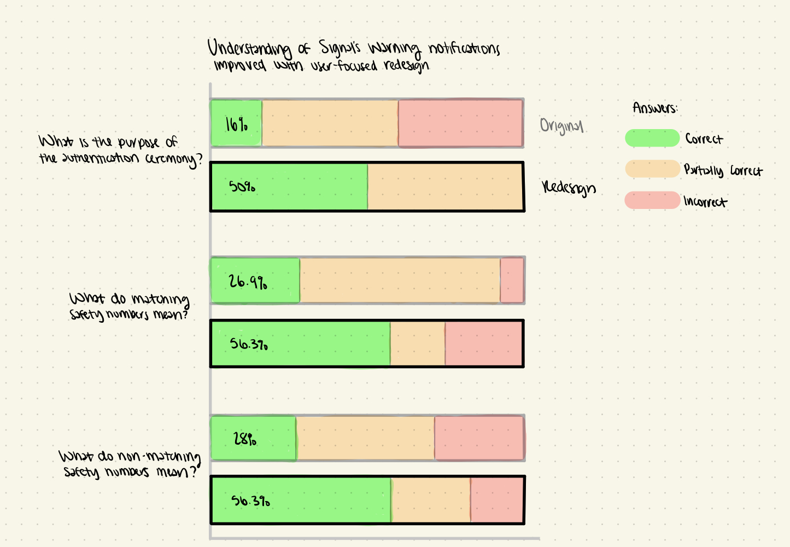

| [home page](README.md) | [visualizing debt](visualizing-government-debt) | critique by design | [final project I](final-project-part-one) | [final project II](final-project-part-two) | [final project III](final-project-part-three) |

# Critique by Design

## Chosen Visualization

The following visualization shows the results of the user testing performed by Wu et al. in the following research paper: ["Something isn't secure, but I'm not sure how that translate into a problem": Promoting autonomy by designing for understanding in Signal](https://www.usenix.org/conference/soups2019/presentation/wu). In summary, Wu et al. sought to demonstrate how their redesign of Signal's warning notifications improves user comprehension and empowers them "to make personal trade-offs between perceived risk and response cost." This data visualization is presented to showcase their positive findings.

I chose to critique and redesign this table in particular because, as elaborated upon in the critique, it is a great example of a data visualization that focused on presenting the data rather than engaging the reader and telling an engaging story. 

## Critique

### Usefulness
**Score: 10**. Overall, this data visualization is very useful. Since this is a part of a research paper, the primary use of this table is for the authors to be able to back up their claims with concrete numbers. As mentioned in the paper, "This table reveals that comprehension of the purpose of the authentication ceremony and of the significance of matching and non-matching numbers visibly improved with our redesign." Therefore, by showing how more users received correct answers for their redesign when compared to Signal, this table adequately accomplishes the authors' goals.

### Completeness
**Score: 4**. The completeness of this data visualization depends on the audience. If the audience is someone who read the entire paper and sees this chart after being directed to it and given a thorough explanation (for example, 'see Table 2, which shows ...'), then the table is relatively complete. It shows, for the three types of questions asked, how many users, both actual numbers and percentages, answered correctly, partially correctly, and incorrectly for both designs. However, it would likely take the reader a few moments to realize that each of the three boxes labeled 'Auth. cerem.,' 'Matching,' and 'Non-matching' corresponds to the questions regarding 'the purpose of the authentication ceremony' and 'the meaning of the matching or non-matching result.'

On the other hand, given that many readers simply skim through research papers to quickly decide whether they should read the whole paper, then the chart is arguably very incomplete. Not only would it be unclear that each box corresponds to the responses given to different questions, but also the meaning of especially 'matching' and 'non-matching' would be difficult to understand. Furthermore, it would likely take a while for the reader to realize that the text represents the general ideas present in answers that were given the corresponding category, and it would be difficult to argue that all of that text is necessary in the first place. 

### Perceptibility
**Score: 3**. In general, this data visualization requires the readers to compare small numbers to understand the overall takeaway that the authors' redesign resulted in more correct answers. However, some effective choices made were showing the original Signal data in the left column and the redesign in the right column. Not only does this clearly separate the two types of data, but it also somewhat aligns with the general notion of time advancing towards the right. Furthermore, correct, partially correct, and incorrect are color coded with the appropriate green, yellow, and red colors accordingly. Despite this, actually decoding which warning design is better requires the reader to look at the relatively small, bolded numbers/percentages and compare the two values not only between the two designs, but also between the three questions, which this design makes relatively difficult.

### Truthfulness
**Score: 9**. Overall, this data visualization is accurate and valid. The only slight confusion come from the fact that while it seems as though there were 25 participants answering questions about the original Signal design and 16 for the redesign, it is unclear and unclarified in the paper why the total number of partially correct responses for the matching question for Signal is 26. 

### Intuitiveness
**Score: 7**. A table is a very familiar, simple, and intuitive data visualization. However, as mentioned earlier, it is a unclear that the three section correspond to three different research questions and the user's responses to each.

### Aesthetics
**Score: 3**. There is nothing special or particularly aesthetic about this design. While the colors do add to the visualization, a table is a very plain and simple way to display data.

### Engagement
**Score: 4**. Similarly to aesthetics, there is nothing particularly engaging about a table of words and numbers. While there is not much that distracts from the data, the table's primary purpose seems to be to show the data rather than engage the reader in any meaningful manner. 

### Overall Observations 
Overall, this data visualization adequately showcases the data that the authors of this paper collected during the user studies conducted. Besides including all of the user's individual, complete responses, which would have likely been an overwhelming amount of data, the authors included all data that may be wanted. Furthermore, the overall design of the table is relatively well done, with clean columns and appropriately color-coded rows. 

However, the key aspect of this data visualization that can be improved is the presentation of the data. The key data points are in small numbers that are very difficult to compare, both between the designs and between questions. If I were to do something differently, I would create a visualization that would allow for easier comparisons of the data through the use of, for example, bar charts or scatter plots. This would not only lower the reader's cognitive load, but it would also allow them to quickly verify that the message articulated in the paper is in fact supported by the data. 

### Primary Audience
The primary audience includes anyone who chooses to read this paper, including academics and students. More specifically, this paper is a part of the Symposium on Usable Privacy and Security (SOUPS), so most readers would have knowledge of privacy and security or would like to learn more about the topic. For this audience, this data visualization adequately showcases the data that the authors collected. Furthermore, the primary takeaway that the authors wanted to convey, that being that their redesign increased user understanding of the authentication ceremony using Signal, is directly stated in the paper itself so the table is simply a way to show the data collected that backs up this claim. This conclusion that the table is only truly effective for those want the raw data is supported by the fact that it is quite difficult to verify the author's claim and compare the small numbers that count the number of participants in each category.

However, many individuals don't read each paper in detail. Instead, many focus on the abstract, conclusion, and the visualizations to gain a basic understanding of the research conducted and conclusions reached in order to decide if reading the entire paper is worthwhile. In those cases, this visualization is not as effective since the data points are difficult to compare and the meaning behind 'Auth. cerem.,' 'Matching,' and 'Non-matching' is unclear without having read the entire paper. 

### Final Thoughts
Overall, this method for evaluating data visualizations seems quite effective. In particular, it allows for specifically quantifying how the data visualization succeeds and struggles on a variety of parameters. Instead of generically stating that something was 'good' or 'bad,' this method allows for further granularity. For example, this method highlights how this visualization succeeded in metrics such as usefulness and truthfulness but not aesthetics or engagement. Therefore, when it comes to redesigning, it can perhaps be easier to find which areas need improvement.

However, the Good Charts method helped in the transition from general ideas to specific observations. By starting with what was seen first then moving to likes/dislikes before finally identifying things to change, it was easier to formulate more specific thoughts overtime instead of having to truly understand the positive/negatives of a chart at first glance. Therefore, what may be a helpful approach is a blend of the two. The critique could begin with the Good Charts method in order to gain a better understanding of the visualization and once this understanding is attained, then the conclusions can be categorized based on the above method.  

In conclusion, my primary recommendation for this chart would be to allow for meaningful comparisons between data points through the use of, for example, bar charts or scatter plots. Furthermore, the labels could be more descriptive to help readers understand this chart without having to read and understand the entire paper.

## Sketch of Redesign

As mentioned in the critique above, the primary focus of this redesign was to help users compare the correctness of answers given between the original and redesigned warning notifications. To aid in this comparison, I chose to use stacked bar charts with the data for the original and the redesign for each question being right next to one another. This showcases the percentages well while keeping the focus on the correct responses. This focus was highlighted through a darker color and adding the exact percentages. To make the questions clearer, I labeled each set of stacked bars with an approximation of the question asked. Finally, I highlighted the redesign data with a darker black and added a title to emphasize the key takeaway. Some aspects from the original that I chose not to include are the actual number of participants as it may be a bit confusing why the same number would result in different percentages, as the two sample sizes were different. I also didn't include the various answer categories, as I felt that it distracted from the main ideas and would clutter the chart unnecessarily. 

## User Tests

### Results
The overall feedback for the redesigned data visualization was relatively positive. Both users, either initially or after a few moments of exploration, quickly came to the conclusion that green signified something positive. Moreover, they both realized on their own that one of the key takeaways from this chart is that the redesign performed better. 

However, the two users mentioned different aspects of the visualization that initially confused them. For one user, they found that comparing the data for the partially correct (and incorrect) data was a bit difficult due to lack of alignment and percentages. However, the other user did not pay as much attention to that data since they believed that the percentage of correct answers was most important and the rest of the data was there more to provide some context for the rest of the answers given. What the other user did comment on though was that it took them a while to realize that the gray bars were for the original and the black were for the redesign. This didn't seem to be a problem for the first user, but it was definitely something that took a bit to notice as the colors drew their attention at first. 

One aspect of the user testing to note is that some background context regarding key terms in the paper were given before showing the visualization. While ideally the visualization could speak for itself, it would take a lot of words to adequately explain what 'Signal,' 'authentication ceremony,' 'matching,' and 'non-matching' meant in this context. Although one user did mention wanting some more clarification for the differences between 'matching' and 'non-matching' in particular, this visualization would likely be seen in the context of a research paper and many of these terms are explained in the paper's abstract and conclusion, so users who skim the paper would likely still understand at least the basics. Finally, the key idea that the redesign performed better is still very clear even if the specific security/privacy terms are not known. 

Some design changes that may make sense include adding percentages for all categories but in a lighter color for partially correct/incorrect. This would keep the focus on the green/correct answers while still providing concrete numbers for the other categories if the reader wants it. Also, the label for the legend can be made clearer to emphasize percentages. Finally, the next iteration of this chart could highlight the difference between the original data and the redesign data in a clearer manner. 

### Notes taken 

#### User 1
- Green stands out
- Likes seeing the green get bigger between the two sets of bars
- Originally thinks of 'yay, great' when looking at the green and the legend supports that conclusion
- Overall, the visualization is showcasing the redesign's improvement 
- Find the partially correct (and incorrect) bars harder to compare because they are not aligned like the green is and doesn't include specific percentages that could help out
- A key takeaway they had from the visualization was that while the user-focused redesign improved a lot, there is still more to improve on
- Seems like a visualization focused on comparing the two designs
- Found labeling the chart with questions as a bit strange 
- Suggested putting percentages for all bars, but lighter for the partially correct/incorrect responses
- Also suggested relabeling 'Answers: ' to 'Accuracy of Understanding: ' to clarify the data, especially the meaning of the percentages
- When shown the original table after, their first thought was that it was very confusing and unpleasant to look at
- Found it very difficult to compare the data and while they wanted to use the sizes of the various rows to help with the comparison, they soon realized that the sizes were variable only because of the number of categories within the section 

#### User 2
- The three bars highlighted in black stand out initially
- Believed the graph was showing if people understand the warnings' purpose, with green meaning that they get it
- The authors seem to be suggesting that the redesign is better, or at the very least is more clear to the users
- The difference between 'matching' and 'non-matching' is confusing
- Likes the percentages only on the green bars, as the main point is whether people understand the design
- Took a while to realize that the gray bars were the original and the black were the redesign
- When shown the original table after, their first reaction was that it was really bad 
- While they liked the colors, they were immediately overwhelmed and found the numbers really hard to find

### Users 3, 4, 5, 6 (in class group feedback)
- One mentioned that while they like the bold outline around the redesign bars, it did take them a while to realize what that outline was for
- Another mentioned that the point of the visualization, that being that the redesign improved user understanding, took them a while to get as it seemed lost in the data. They suggested maybe changing the title to be more concise and direct, such as 'Redesign improves user understanding of ...'
- Another mentioned that they were unsure what the authentication ceremony was referring to. While they realized that this would likely be clarified in the paper itself, they suggested either rephrasing the question to add more information, adding a footer with context and perhaps a link to the specific section in the paper, or including this information in a tooltip for the electronic version. 
- This comment prompted a discussion about labeling the research questions column and making the questions more concise and focused
- One mentioned that they usually see bar data vertically, not horizontally, but anther added that it does work well horizontally with the research questions  
- One suggested to gray out the partially correct/incorrect data to draw further attention on the green data, as that is what they assumed was the key takeaway from this visualization
- When shown the original table after, they all immediately mentioned that it was bad, overwhelming, and 'all text'

## Final Redesign

For the final redesign, percentages were added to all categories with the focus remaining on the darkest green, correct responses. Additionally, the legend title was changed to 'Response Accuracy' to better reflect the categories and the data. Because this is a digital rendition, tooltips were added that show the number of user responses along with the percentages. However, displaying the original/redesign labels on the left for all bars as well as not highlighting the redesign bars in any way was due to Tableau limitations. 

In the end, while the final redesign did remove some data, it does allow the reader to easily compare the data and to engage with the story being told by the visualization. 

<noscript></noscript><object class='tableauViz'  style='display:none;'><param name='host_url' value='https%3A%2F%2Fpublic.tableau.com%2F' /> <param name='embed_code_version' value='3' /> <param name='site_root' value='' /><param name='name' value='CritiquebyDesign&#47;Dashboard1' /><param name='tabs' value='no' /><param name='toolbar' value='yes' /><param name='static_image' value='https:&#47;&#47;public.tableau.com&#47;static&#47;images&#47;Cr&#47;CritiquebyDesign&#47;Dashboard1&#47;1.png' /> <param name='animate_transition' value='yes' /><param name='display_static_image' value='yes' /><param name='display_spinner' value='yes' /><param name='display_overlay' value='yes' /><param name='display_count' value='yes' /><param name='language' value='en-US' /><param name='filter' value='publish=yes' /></object>

