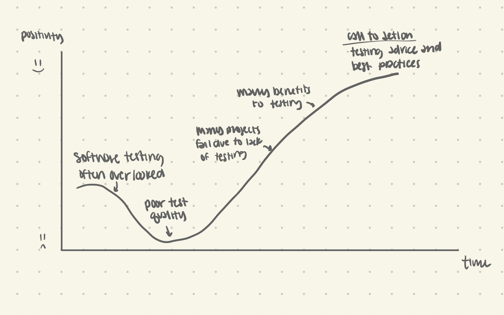
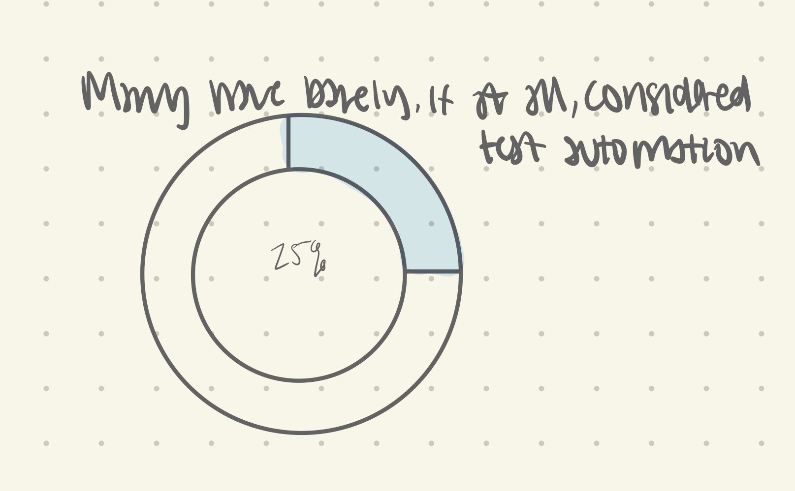
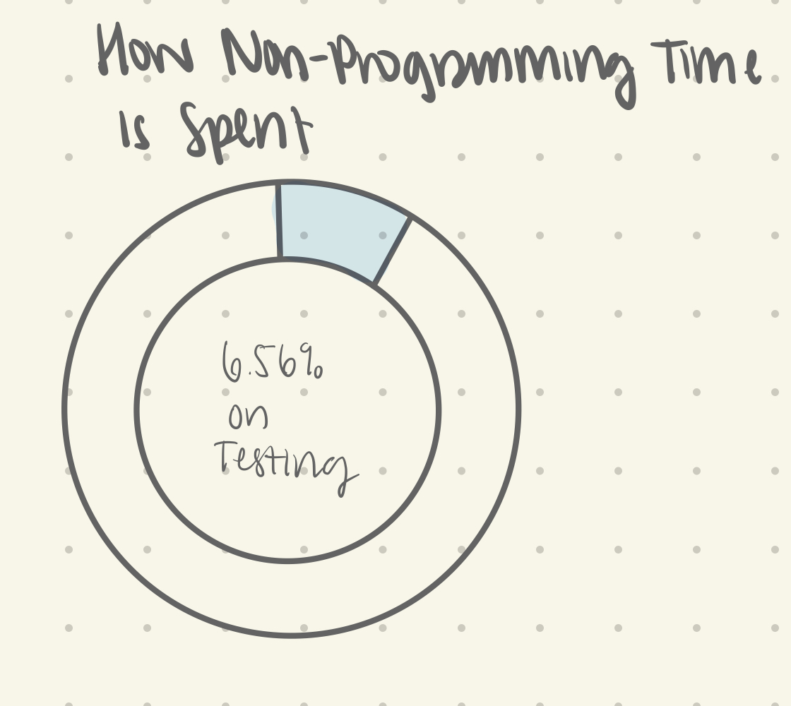
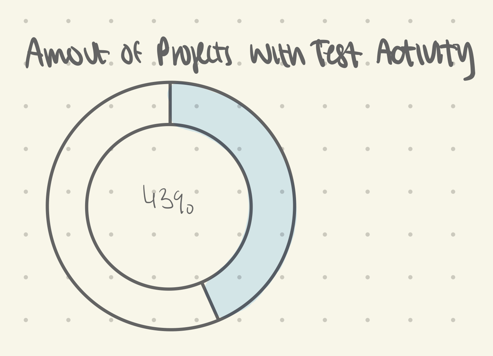
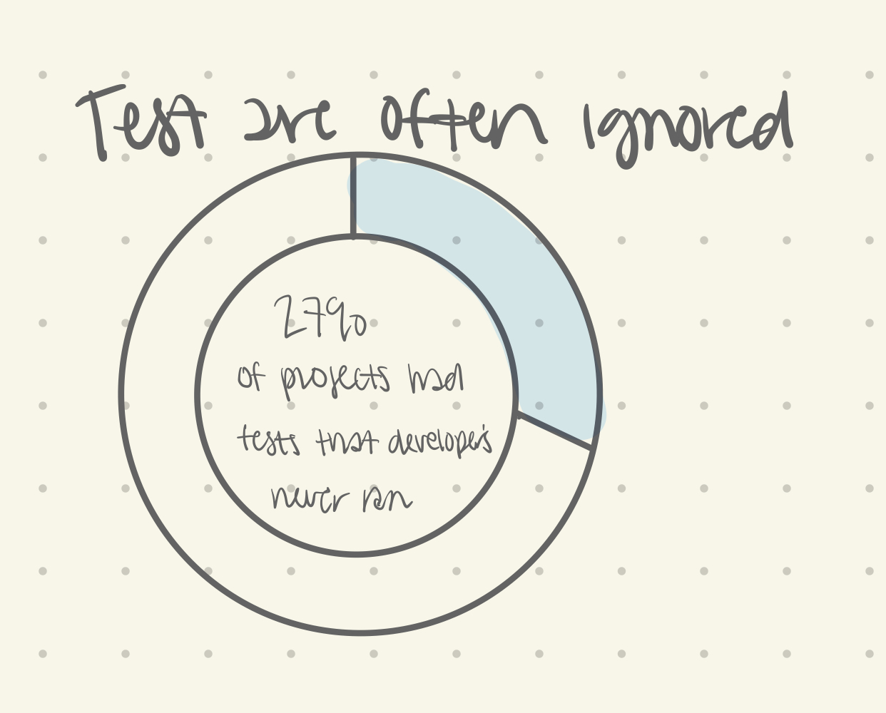
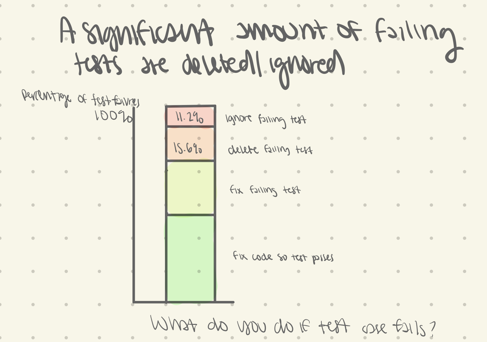
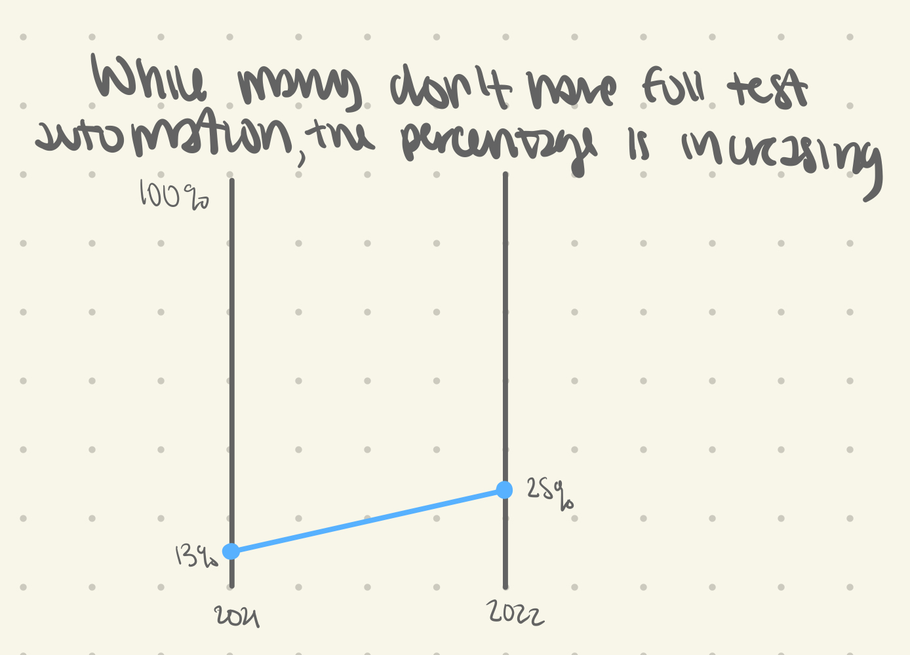
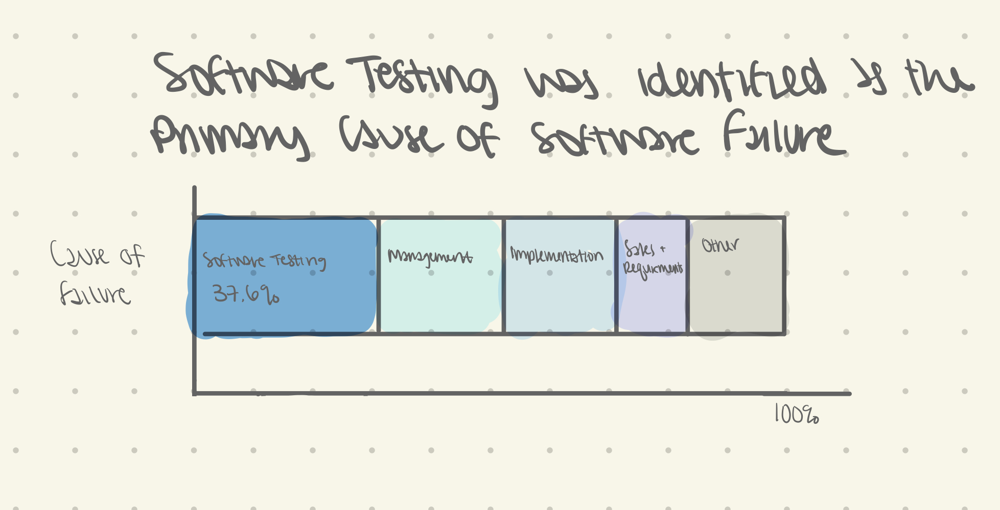
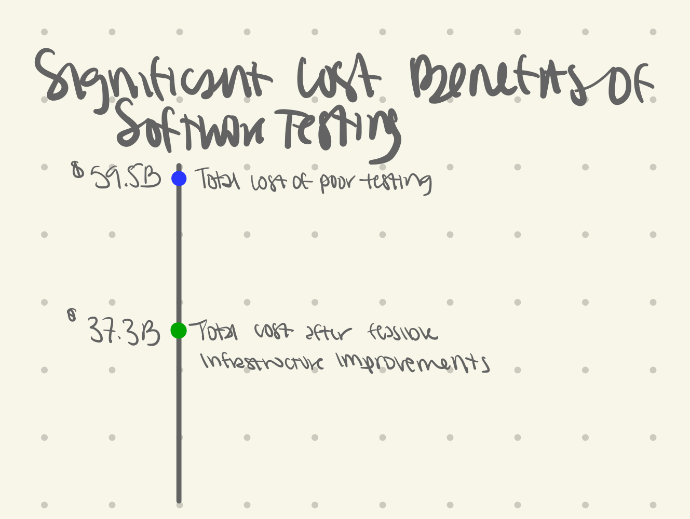

| [home page](README.md) | [visualizing debt](visualizing-government-debt) | [critique by design](critique-by-design) | final project I | [final project II](final-project-part-two) | [final project III](final-project-part-three) |

# Importance of Testing in Software Development

## Outline
> Include a high-level summary of your project.  This should be a couple paragraphs that describe what you're interested in showing with your final project. 
 
While software testing is often overlooked by many, it is critical to a project's success.

### Project Structure
- Testing software is often overlooked
- Furthermore, when code is tested, it is not of high quality or even ignored 
- However, many software projects fail, with one major reason being lack of quality testing
- Testing also provides many other benefits to the developers and the project as a whole
- Call to action: advice and best practices for incorporating testing into the software development lifecycle. 

### Understanding the Audience
The primary audience for this project are software developers, especially those who do overlook the importance of testing. Other members of the target audience include project managers and other high level managers of software projects. 

#### User Stories:
- As a software developer, I want to know if writing tests for my software is beneficial so I know how much time and resources I should allocate towards it. 
- As a project manager, I want to understand the importance of testing so I know how much of the project's time I should allocate towards it. 

## Initial Sketches
Below are rough sketches of ideas for data visualizations that will support the overall story. These sketches represent only a small subset of the data visualizations that will present in the final presentation. Also, in general, the majority of these data visualization will be relatively simple, as the current data available is often focused on simple surveys and simple, call-out statistics. 

Above are a few examples of simple data visualizations that call out the current outlook towards software testing and how tests that are written are often ignored. This donut visualization visualizes the percentage of software projects/respondents without cluttering the chart with irrelevant data. 

Above is a stacked bar chart that furthers the lack of importance that is placed on software testing by a significant amount of developers. The stacked bar chart accurately visualizes the percentages while providing more data than simple donut charts. 

Above is a slope chart that shows how, although the percentage of developers who have full test automation is relatively small, it is slowly increasing. Data visualizations such as this will provide a transition from negative outlooks towards software testing to a more positive, accepting outlook. 

Above is another stacked bar chart that shows the common causes of failure for software projects, with the highest being software testing. All other categories are included to show the audience that although there are many reasons why projects fail, software testing is one key reason and with robust testing, the chance for project failure will simply decrease. 

Above is a simple dot plot that showcases the significant cost that comes with poor testing practices. However, it also shows how even relatively simple, feasible infrastructure improvements can dramatically decrease this cost. 

# The Data
Most of the data used for this project will come from reports or research papers. The data collected therefore will usually be by hand from the various data visualizations and tables present in these sources. Since there is no centralized dataset, many sources will be used and more will be added as the project evolves. 

1. https://stevemcconnell.com/articles/upstream-decisions-downstream-costs/ 
- Contains a chart about the rising costs to correct a defect based on when it is detected and then corrected. 
2. https://cdn.activestate.com/wp-content/uploads/2019/05/ActiveState-Developer-Survey-2019-Open-Source-Runtime-Pains.pdf?_ga=2.72822227.1964449080.1676299660-1241190181.1676299660
- Contains information about how software developers spend their time, including time spent on testing
3. https://content.microfocus.com/l/reduce-defects-software-tb?utm_source=techbeacon&utm_medium=referral&utm_campaign=7014J000000dVOkQAM&utm_term=keeplearning&utm_content=appdev&_ga=2.67739736.834447451.1676323379-801391211.1676323378
- Articles about how continuous integration and quality assurance can help projects
- This will be a good source for the call to action rather than for the data
4. https://ieeexplore.ieee.org/stamp/stamp.jsp?tp=&arnumber=8116886
- Provides information about developer's beliefs about testing
- Findings were that tests were often not done, the tests were not of high quality, they were misguided about the amount of time spent on testing, and more.
5. https://www.nist.gov/system/files/documents/2021/03/24/econImpactSumm.v23.pdf
- The financial cost of poor testing and how simple practices can dramatically decrease this cost.
6. https://about.gitlab.com/images/developer-survey/gitlab-devsecops-2021-survey-results.pdf
- GitLab survey about improvements to testing and DevOps practices
- Also includes anecdotes about developer's feelings towards testing
7. https://ieeexplore.ieee.org/stamp/stamp.jsp?tp=&arnumber=6982627
- Common practices when writing unit tests and the problems that often plague them. 
8. https://www.sciencedirect.com/science/article/pii/S0950584914000263
- Perceived causes of software failure, including poor/nonexistent software testing

# Method and Medium
I plan on primarily sketching my initial ideas by hand, both for data visualizations as well as the overall presentation. After sketching, I will primarily use Tableau for data visualization and Shorthand for the presentation. 

Outlined in a general schedule for this project:
- Gather more data sources
- Sketch more data visualizations based on those data sources
- Transfer all relevant data into excel spreadsheets
- Create digital data visualizations
- Design general wireframes focusing on the general layout
- Write a rough draft of the written content supporting the data visualizations 
- Finalize the story with a storyboard
- Conduct user research through interviews (multiple rounds)
- Incorporate user feedback
- Finalize all aspects of the presentation
- Present the final story

